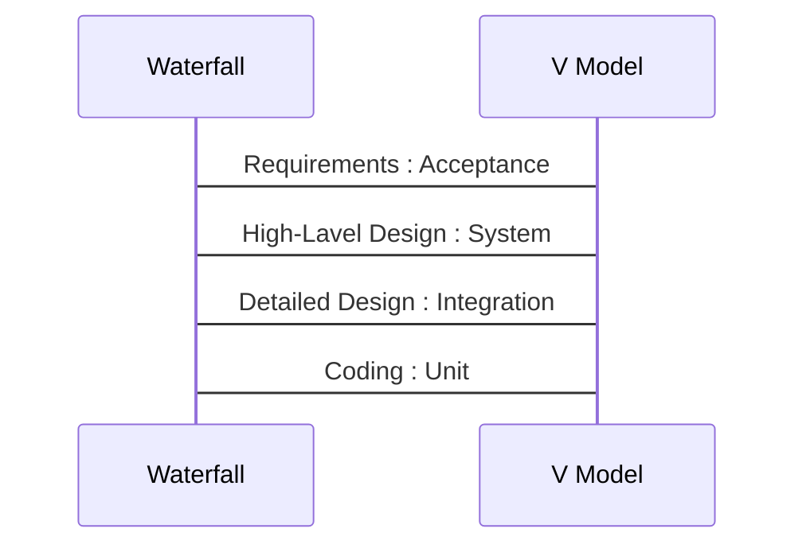

# Testing Life Cycle

## The General V-Model

### อธิบาย

- มักใช้กับ Software Model แบบ **Waterfall** 
- ปกติ Testing เป็นขั้นตอนหนึ่งใน Waterfall model แต่ในขั้นตอนของการ Testing แบบ V-model จะ แบ่งขั้นตอนการ Test ควบคู่กับ Waterfall model คือ




# W-model

## อธิบาย


# Another Testing Life Cycle

## Requirements Phase

### อธิบาย


### ตัวอย่าง


## Planning Phase

### อธิบาย


### ตัวอย่าง


## Analysis Phase

### อธิบาย

ขั้นตอนทำความเข้าใจในสิ่งที่จะทดสอบ

### ตัวอย่าง

เช่น ทดสอบหมายเลขบัตรประชาชน เราก็ต้องเข้าใจโครงสร้างของหมายเลขบัตรประชาชนก่อน นั้นคือเราก็จะมาสู่ขั้นตอนการวิเคราะห์


## Design Phase

### อธิบาย

ออกแบบข้อมูลที่เราต้องใช้ทดสอบให้ตรงกับความต้องการของ Software และ ออกมาเป็นเอกสาร

### ขั้นตอน

- Detailed test condition document
  
- อาจจะเป็น UML ที่สามารถเชื่อมโยงเรากับ code ได้
  
- Requirement traceability metrics : ทำเอกสารของเชื่อมโยง ***Requirement กับ Detailed test condition document ส่วนไหน***

  - | Requirement | Detailed test condition document |   Code   | Test |
    | :---------: | :------------------------------: | :------: | :--: |
    |     #1      |                #1                | Line 506 | XX01 |
    |      .      |                .                 |    .     |  .   |
    |     ..      |                ..                |    ..    |  ..  |

  - เสมือนเป็น เอกสาร ดัชนี เชื่อมโยง Requirement กับ Code ที่เขียน

- Test coverage metric

  - เช่น Requirement บอก สามารถใช้งานพร้อมกันหลายเครื่อง &rarr; ***กี่เครื่อง ?***

### ตัวอย่าง

-


## Implementation Phase

### อธิบาย 

- Test Case
- Test Script
- Test Data


## Execution Phase

### อธิบาย


## Conclusion Phase

### อธิบาย


## Closure Phase

### อธิบาย

เป็นเหมือนเอกสารรับรองว่า การทดสอบ software นั้นสมบูรณ์แบบแล้ว ส่งมอบงาน **เสร็จสมบูรณ์**


# Life Cycle of a software bug

```flow
start=>start: New
assignd=>operation: ASSIGNED
resloved=>operation: RESLOVED
verrified=>operation: VERIFIED
end=>end: Closed

start->assignd->resloved->verrified->end
```


---


# V-Model

## 1. Unit test

### อธิบาย

- เป็น ขั้นตอนแรกที่ต้องทำ ในการทดสอบ 
- เป็นแนว **White box** 
  - รู้ Input
  - รู้ **Process** : ดู code ได้ เลยเรียก white box
  - รู้ Output
- ไม่ควร ข้ามขั้น unit test ไปขั้นต่อไป


## 2. Integration test

### อธิบาย

- รันพร้อมกันหลาย modules แล้วทดสอบ
- วิธีการรับมือ
  - Big Bang  [A, B, C, D, E]
    - **ไม่แนะนำ !!!!!**
    - A + B + C + D + E = **!!!!!!!!!!!!!!**
  - Incremental [A, B, C, D, E]
    - A + B = AB
    - AB + C = ABC
    - ABC + D = ABCD
    - ABCD + E = ABCDE


## 3. Unit Test and Integration Test

### Stub and Driver


## 4. System Test

### อธิบาย

- อยู่ใน Environment ที่ ใกล้เคียงกับ สถานการณ์ใช้จริง
- ทดสอบให้รู้สึกวาสใกล้เคียงกับ **ความเป็นผู้ใช้มากที่สุด**
- ปัจจัยจะไม่ใช่ code แล้วแต่จะเป็น ปัจจัยอื่นๆที่ไม่ใช่วามถูกต้องของ code แล้ว เช่น
  - ความน่าใช้งาน
  - ความไว
  - ความปลอดภัย


## 5. Acceptance Test

### อธิบาย

- Beta : มักใช้ฟรี ทดลองระบบ
- Alpha : ใกล้เคียงของจริงสุดๆ แล้ว


----


# Testing in Agile Software Development

- เนื่องด้วย **ความไว** ของกระบวนการ
- ใช้ SMOKE

## Retest

- เกิด error ก็แก้ แล้วต้องไป test ใหม่  [unit, integrate, system, acceptance] test

## Regression test

- ทดสอบการแก้จุดนึง เพื่อไม่ให้ไปโดนไปโดนอีกจุดนึงหรือ ไปส่งผลต่อ requirement ผิด


## Testing and Debugging

- **Testing** : หาปัญหา
- **Debugging** : ตรวจให้มั่นใจว่าปัญหาถูกแก้แล้ว


---


# Test Plan

- configuration
- security
- functionality : ไล่ตาม requirements
- performance
- environment


---


# Bug Life Cycle

```flow
start=>start: Start
test_exe=>operation: Test Executed
tpr_raise=>operation: TRP Raised
tpr_tracked=>operation: TRP Tracked
retested=>operation: Retested
problem=>condition: Problem Reappears
tpr_closed=>end: TRP Closed

start->test_exe->tpr_raise->tpr_tracked->retested->problem
problem(no)->tpr_closed
problem(yes)->test_exe
```

